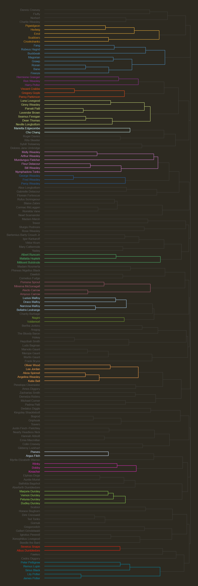

# Thematic map of Harry Potter characters

#### Related Instagram post
* https://www.instagram.com/p/BnNwpoZh2OP/

#### Related blog post
* http://roguedatascience.com/the-magic-of-words2vec-in-harry-potter/

This analysis uses word embedding algorithms (and specifically Google's word2vec algorithm) to create a thematic mapping of all the characters in the Harry Potter book series. This mapping then allows to group them into, for lack of a better term, [social cliques](https://en.wikipedia.org/wiki/Clique).

Not surprisingly, given the power and accuracy of these types of algorithms, when looking at the map (below and [in high definition](character_visualization)) and the characters that compose each clique (with the main cliques highlighted), the results of the analysis make intuitive sense for anyone familiar with the books. In order (for the first few):
* pets
* characters from the Magical Forest
* the main trio
* Malfoy's lackeys
* Dumbledore's Army

  

You can see the full breakdown of this analysis in the following link: http://roguedatascience.com/the-magic-of-words2vec-in-harry-potter/. All of the code and media uses for the creation of this post can be found in the [rmarkdown folder](rmarkdown).
