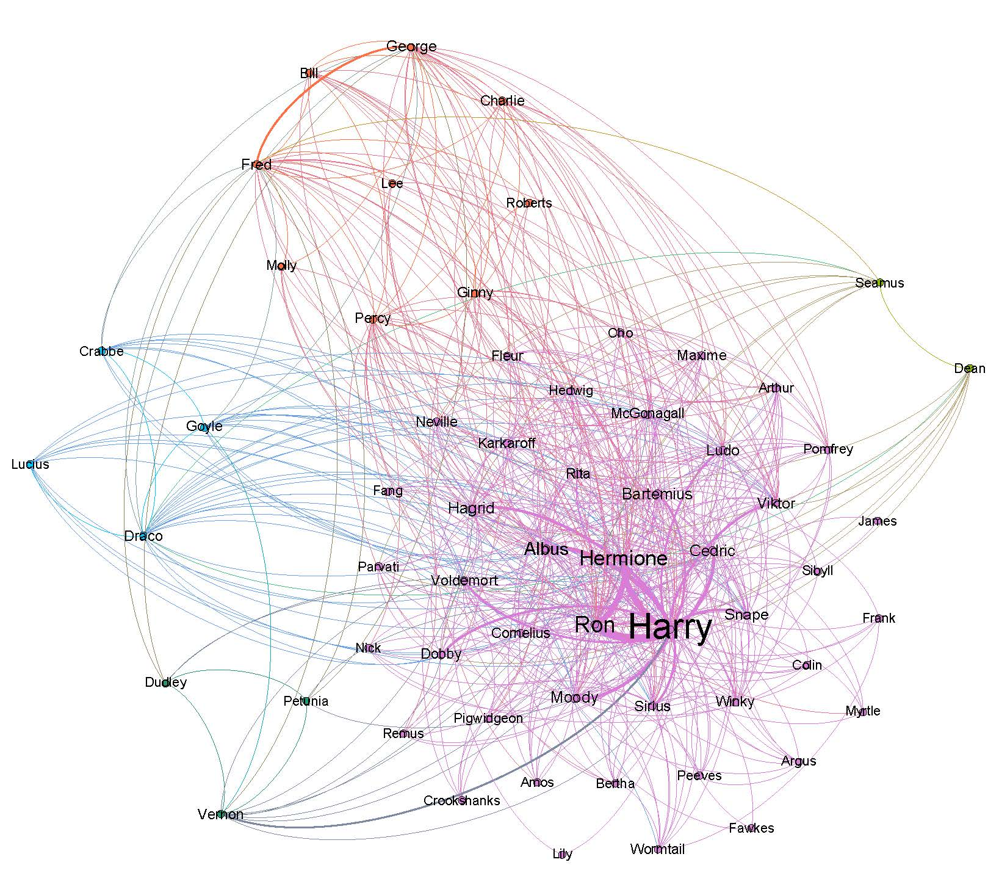
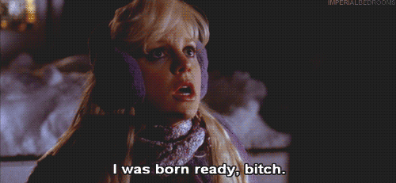
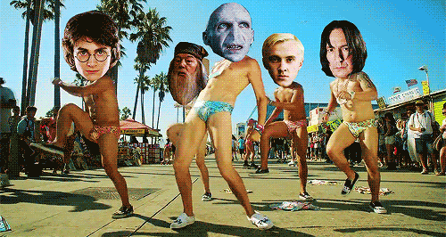

```{r opts, echo = FALSE}
knitr::opts_chunk$set(
  fig.path = "images/"
)
```

```{r echo = FALSE}
# Need to load this to include images
library(knitr)
```


**Overview**: In this post, I will walk you through using word embedding algorithms (aka. vector space models) to extract thematic relationships between the different characters in the Harry Potter book series.
**Reading time**: 45 minutes
**Expertise level**: 4/5  


***


### The motivation

A lot of attempts been made at mapping the social networks of famous books, movies and tv series. For example, here is the Harry Potter network from the Intrepid Mathematician blog:

```{r out.width = '95%', fig.align = 'center', echo = FALSE}

```

<div style="text-align: center;">
Source: [The Intrepid Mathematician](https://anthonybonato.com/2016/08/03/social-networks-in-novels-and-films/)
</div>

As the blog post notes:

> The fun thing was that we derived these graphs without directly reading any of the text of the novels! We devised a graph extraction algorithm (analogous to the one in Network of Thrones) that based on character names being fifteen or fewer words apart in the text.

This technique is spot on and systematic for mapping networks. You can also create these links by asking questions like: Have the characters been in the same paragraph or chapter? But I wanted to move away from networks and take this a step further from these time/space links (conceptually, these techniques notch a link if the characters share time and space). I wanted to try to map Harry Potter's character inside an all-encompassing thematic map.

**Let's get cracking.**  

I'm going to walk you how to create these thematic maps R. And along the way, I'll give you a 10k foot understanding of vector space models (the backbone of these thematic maps) and point you in all the right directions if you want to explore these further. I hope you enjoy it!  


### First steps

##### Loading libraries

The first step is always to import all the necessary libraries.  

* I use the *tidyverse*, the ultimate data wrangling framework, pretty much in every project I work on
* Instead of downloading the txt files, the *harrypotter* library allows for direct access from R. 
* The *stringr* library is an R workhorse for text processing
* The *wordVectors* and *wordspace* libraries are for the creation and manipulation of vector spaces
* The *proxy* package has a bunch of great distance calculations
* Although I won't load it explicitly, I will also briefly use the *tidytext* library to demonstrate the usefuleness of having texts in a data frame format.
* I won't load the *ggdendro* library for plotting dendrograms, but I will use it. 


```{r load_libraries, message = FALSE, warning=FALSE}
library(tidyverse)
library(harrypotter)
library(stringr)
library(wordspace)
library(wordVectors)
library(proxy)
```


##### *harrypotter* and *wordVectors* libraries from GitHub

The *wordVectors* library were developed by Bradley Boehmke and Benjamin Schmidt, respectively, and are not in CRAN (R's package repository). Instead, you need to install them from his GitHub. Here are some links to help you do that.

* installing packages from GitHub: (https://cran.r-project.org/web/packages/githubinstall/vignettes/githubinstall.html)
* harrypotter GitHub page: https://github.com/bradleyboehmke/harrypotter
* wordVectors GitHub page: https://github.com/bmschmidt/wordVectors
* wordVectors installation: https://github.com/bmschmidt/wordVectors/blob/master/vignettes/introduction.Rmd)

Please note that there is another *harrypotter* library on CRAN that is not the same. If you install and load that one, the code will not work.

One final note: I had some trouble installing the newest version of *wordVectors*. It tuned out my Rtools, which is "a collection of resources for building packages for R under Microsoft Windows, or for building R itself", and which is needed to install GitHub packages, was a little dated. Whether to install it for the first time (you need it for this tutorial) or to update it, here is the link to install Rtools:
https://cran.r-project.org/bin/windows/Rtools/)

Ok, now we are all set. Are you ready? The answer I am hoping for is:

```{r out.width = '80%', fig.align = 'center', echo = FALSE}

```
<div style="text-align: center;">
Source: https://gifer.com/en/79TQ
</div>


### Getting the Harry Potter books' text ready

##### Loading the books

The *harrypotter* library makes it super easy to load each of the seven books. Also, beyond this ease, all the texts are consistent in their format. I have found other resources from which I can download the texts, but the formatting (e.g. spacing between paragraphs) has varied from book to book. Consistency makes text processing much easier. The package loads the books as a character vector where each element is a chapter.

```{r jpg_str}
# Load each book with its order, and annotate the chapters
# Wrapping the data frames in the bind_rows, collapsed them into one
all_books_df <-
    bind_rows(
        data_frame(
            txt = philosophers_stone,
            book = 1),
        data_frame(
            txt = chamber_of_secrets,
            book = 2),
        data_frame(
            txt = prisoner_of_azkaban,
            book = 3),
        data_frame(
            txt = goblet_of_fire,
            book = 4),
        data_frame(
            txt = order_of_the_phoenix,
            book = 5),
        data_frame(
            txt = half_blood_prince,
            book = 6),
        data_frame(
            txt = deathly_hallows,
            book = 7)
    ) %>%
    # Since each vector element is a chapter,
    # this the chapter numbers inside of each book
    # The group_by allows the counts to restart for each book
    group_by(book) %>%
    mutate(chapter = 1:n()) %>%
    # Always a good idea to ungroup to avoid problems later
    ungroup()
```

Having done all this. I now must admit that for this post, creating this data frame is overkill. We are not going to use the data frame format of the different books. But having this format is incredibly useful for libraries like *tidytext* that use data frame structures for text analytics. These libraries are very intuitive, and, as the "tidy" prefix suggests, they fit right into the tidyverse.


##### Small example of *tidytext*

Ok, I cannot help myself. Here is a super brief example of how to see the counts of the word "Hermione" across all books and chapters. I am going to use the "::" notation, which allows you to call a function from a package without loading the entire thing. For python users, this is que equivalent as: from package import function. Just make sure you've installed *tidytext*.

```{r pixel_histogram, fig.height = 6, fig.width = 8, fig.align = 'center'}

tidytext_demo_df <-
    all_books_df %>%
    # The following creates a data frame with 3 columns:
    # book and chapter (from the all_books df)
    # and word, the breakdown of text into a "bag of words"
    tidytext::unnest_tokens(output = word, input = txt)

# Create line chart of the counts of "hermione" over each of the books
tidytext_demo_df %>%
    # Filter for "hermione"
    filter(word == 'hermione') %>%
    # Create counts for each book-chapter pair
    group_by(book, chapter) %>%
    summarise(cnt = n()) %>%
    # Plot the lines broken up by books
    ggplot(aes(x = chapter, y = cnt)) +
    geom_line() +
    facet_wrap(~ book, nrow = 2)


```

I really hope that you can see the enormous value in this type of text analytics in R. It is incredibly intuitive and useful.

In case you want to dig a little deeper into this, go straight to the source. This is a book written by the people that wrote the library:
https://www.tidytextmining.com/.

Ok. Sorry for the tangent...

```{r out.width = '80%', fig.align = 'center', echo = FALSE}
include_graphics('vikings_onward.gif')
```
<div style="text-align: center;">
Source: http://historyvikings.tumblr.com/post/143267209188
</div>

Btw, if you haven't watched Vikings yet, it is spectacular!
https://www.google.com/search?q=vikings+rating


##### Exporting the text

To create the vector space model (I will explain in just a little bit what that is all about), the *wordVectors* library needs for all the text to be stored in a folder. This is typically called a corpus. Although I have not read this explicitly anywhere, the probable reason for reading from a folder is that, given all the calculations and thus RAM that R needs to run the algorithm, it is better to not have the text already loaded and taking up memory. Moreover, you might want to create a vector space model with a lot of text, and it might not all load into memory.

For example, Google trained its word2vec algorithm on close to 50 billion words:
http://mccormickml.com/2016/04/12/googles-pretrained-word2vec-model-in-python/

In comparison, all the Harry Potter books have about 1.1 million words. If you are wondering where I got this number, it's simply the number of rows of tidytext_demo_df. The tidytext demo did come in handy!

```{r row_num}

# See the top rows
nrow(tidytext_demo_df)

```

To store the text, we just need to collapse all the books into a single character vector and dump it into a text file. I create this file inside of a folder called "all_books", which has already been created.

```{r row_num2}

# Collapse the data frame column containing all the text
all_books <-
    str_c(all_books_df, collapse = '\n\n\n')

# Establish a connection with the file
file_conn <- file('all_books/hp_all.txt')

# Dump the vector into it
writeLines(all_books, file_conn)

# Close the connection
close(file_conn)

```

Perfect. Now we have the text document with all the HP books in the all_books folder. Note that it would have also been fine to create 7 different files, one for each book.


### Creating the vector space model

##### First thing first: what the hell is a vector space model?

A vector space model, for lack of a better explanation, is a map. Although these models tend to have hundreds of dimensions, lets first work with just 2. This allows us to think of it as a flat surface (or a cartesian plane), just like a map. The points on a map (e.g. towns or cities) have an x value, longitude, and a y value, latitude.

```{r out.width = '90%', fig.align = 'center', echo = FALSE}
include_graphics('europe_map.jpg')
```
<div style="text-align: center;">
Source: [asperia.org](http://asperia.org/map-western-europe-cities/europe-map-cities-download-map-western-europe-cities-major-tourist-attractions-maps-650-x-655-pixels-on-map-western-europe-cities/)
</div>

These points also have relationships between one another, distance being the most basic: what is the closest city to Germany? Or: which is farther from Berlin, Paris or Brussels? To the idea of distance, you might also add direction: where would we end up if we took the vector (or the line) going Berlin to Paris, but started at Brussels? This is the equivalent of:

<div style="text-align: center;">
**Paris - Berlin + Brussels**
</div>

Probably somewhere in the Atlantic.

It's very easy to check. Create a vector with latitude and longitude for each of the cities (got them from Google) and check the result of the calculation.

```{r city_calc}

# Create vectors
paris <-
    c(48.8566, 2.3522) 

berlin <-
    c(52.52, 13.405)

brussels <-
    c(50.8503, 4.3517)

# Calculate new vector
# Note on dealing with North, South, East and West:
# north latitudes are positive and south latitudes are negative
# east longitudes are positive and west longitudes are negative
new_vector <-
    paris - berlin + brussels

new_vector


```

So, the new vector is 47.1869N, 6.7011W. A quick Google search for these coordinates and we can confirm that the new vector is indeed in the Atlantic.

```{r out.width = '90%', fig.align = 'center', echo = FALSE}
include_graphics('new_vector.JPG')
```
<div style="text-align: center;">
Source: [Google Maps](https://www.google.com/maps/place/47%C2%B011'12.8%22N+6%C2%B042'04.0%22W/@48.4101682,3.5432826,5z/data=!4m5!3m4!1s0x0:0x0!8m2!3d47.1868889!4d-6.7011111)
</div>

If we consider this example as a table or data frame, Berlin, Paris and Brussels have vectors (rows) with 2 values (columns), latitude and longitude. We could also add population as a 4th, non-spatial, dimension. Although it is very difficult to visualize how this would work, you can certain calculate a difference between the population of Paris and that of Berlin, which would be the equivalent of a distance.


##### Ok, so what does this have to do with text?

Keeping the original 2-dimensional map in mind, but now replace the cities with the words of a text. Now you got yourself a vector space model. The dimensions don't have a significance like latitude and longitude. But all the comparisons we discussed, in terms of distance and direction, can certainly be maintained.

It is precisely through these comparisons that the word2vec algorithm that Google created got its fame.
http://mccormickml.com/2016/04/12/googles-pretrained-word2vec-model-in-python/

Remember how we discussed calculating Paris - Berlin + Brussels? Google did something similar:

<div style="text-align: center;">
**king - man + woman**
</div>

The result of this operation was:

<div style="text-align: center;">
**queen**
</div>

```{r out.width = '70%', fig.align = 'center', echo = FALSE}
include_graphics('word2vec_king_queen_vectors.png')
```
<div style="text-align: center;">
Source: https://www.depends-on-the-definition.com/guide-to-word-vectors-with-gensim-and-keras/
</div>

And this result makes perfect sense: if you convert a king from a man to a woman, you get a queen. So, the vector space model was so well created that is contained the very subtle concepts of gender and monarchy, and they were essentially operational.

There are a lot of super interesting results that came from Google's "word map". Here are some links that discuss them and how the word2vec algorithm works in detail:

* https://www.tensorflow.org/tutorials/representation/word2vec
* https://skymind.ai/wiki/word2vec


##### So, in conclusion

A vector space model is simply a map. Although many applications (including this one) have to do with text analytics and natural language processing (so creating maps of words), there are many other applications of these models. For example:
https://towardsdatascience.com/a-non-nlp-application-of-word2vec-c637e35d3668.

Fivethirtyeight also had an amazing article of using a vector space model of Reddit groups for better understanding the groups related to Donald Trump:
https://fivethirtyeight.com/features/dissecting-trumps-most-rabid-online-following/.

So, there is a huge amount of applicability.

Now we're ready to get our hands dirty.


##### Training the vector space model

Before training the vector space model ("training" in machine learning terminology means running data through an algorithm), the *wordVectors* library preprocesses the data. This is just like any other text analytics process in which the excesses of the text (uppercase letters, stop words, punctuation, etc.) are removed from the text. This is essentially removing noise to get the best signal possible. Once again, the results are saved as an external file to not take space in memory. Although in this example we only have a single source file (all 7 books in a single document), if we had more files in the origin folder, they all would be processed and concatenated into a single destination file. 

```{r vector_space_preprocessing, results = 'hide', message = FALSE}

prep_word2vec(
    origin = 'all_books',
    destination = 'hp_all_processed.txt',
    lowercase = TRUE,
    # ngrams refers to the maximum number of words per phrase
    bundle_ngrams = 2)

```

Now that we have the preprocessed file, we can train the model. Once again, the results are stored in an external file (a binary file) which then can be read in. Note that the training could be assigned into an object (object <- train_word2vec(...) ), in which case it would have both written the binary file and kept it in an object in memory. Other than the choice of number of dimensions, the rest of the function parameters go into the innerworkings of the word2vec model. The library's GitHub page has further explanations that you can explore and get further insight into what each parameter is tuning.

```{r vector_space_creation, results = 'hide'}


# Only train model if the binary model file does not exist
# If model exists, the train_word2vec function throws an error
if(!file.exists('hp_all_processed.bin')){
    
    # Train the model
    train_word2vec(
        train_file = 'hp_all_processed.txt',
        output_file = 'hp_all_processed.bin',
        # This defines the number of dimensions per vector
        vectors = 200,
        threads = 4,
        window = 12,
        iter = 5,
        negative_samples = 0)
    
}

# Read the model's binary file
suppressMessages(
    w2v_model <-
        read.binary.vectors('hp_all_processed.bin')
)

```

And that's it. The model is complete.


### Exploring the results

##### Playing around with similarities

One of the most interesting features of vector space models is the ability to test the proximity of the model elements, in this case the words and phrases of the Harry Potter books. For the more curious among you, this is done by looking at the cosine similarity between elements. Here is a great example and explanation of how cosine distance is calculated and why it is a better metric for these types of models (as opposed to something Euclidean distance): https://cmry.github.io/notes/euclidean-v-cosine.

The *wordVectors* package has a very easy to use function for just this calculation.

```{r similarities}

# Get the 10 closest concepts to "patronus"
w2v_model %>%
    closest_to(vector = "patronus", n = 10)

```

As you can see, the closest concept to "patronus" is "stag". This makes complete sense. In the books, patronuses usually appear when Harry produces them and Harry's patronus is a stag. Still, even though the cosine similarity of "stag" is considerably larger that the next closest, there are going to be other terms that are much closer to one another. There are other cool things that you can do (king - man + woman type operations). I recommend you look at the GitHub documentation of the *wordVectors* to get some ideas.

```{r out.width = '95%', fig.align = 'center', echo = FALSE}
include_graphics('expecto_patronum.jpg')
```
<div style="text-align: center;">
Source: [Shepherd of the Gurneys](http://shepherdofthegurneys.blogspot.com/2016/12/expecto-patronum.html)
</div>


##### Getting character vectors

A very similar way of analyzing vector space data is through a clustering algorithm. If you are not familiar with clustering, it groups the observations of a dataset that are closest to one another based on a chosen distance metric. Here is a great explanation of clustering and its main algorithms:
https://www.analyticsvidhya.com/blog/2016/11/an-introduction-to-clustering-and-different-methods-of-clustering/.

In this vector space model, clustering would allow to determine which terms in the Harry Potter books naturally group together.

Although it would be very interesting to see how all the books' concepts cluster, I am more interested in how the different characters cluster. For this, I got a list of all Harry Potter characters from Wikipedia and added a few more variables (stored in the harry_potter_characters.csv file). The most important of these is a search parameter.
https://en.wikipedia.org/wiki/List_of_Harry_Potter_characters

For example, instead of looking for instances of "Alastor Mad-Eye Moody" in the text, I would simply look for "Mad-Eye". This might not be perfect since there are instances in which he is referred to as "Alastor", but it works well enough. The optimal way to search would be have multiple search terms per character and have them all map to a single name, but for the vector space models, these changes must be made to the source text. So, for the sake of simplicity, a I used a single term (the one I consider most relevant) for each character.

```{r get_matrix, message = FALSE}

# Read dataset with all characters and relevant metadata
hp_characters_df <-
    read_csv('harry_potter_characters.csv', progress = FALSE)

# Extract the vector space from the word2vec model
w2v_matrix <-
    # It's stored in the ".Data" element of the class
    w2v_model@.Data %>%
    # Convert it to a regular matrix
    as.matrix()
# This matrix has all the vectors representing the different terms
# stored as the rows (the name of the row is the term)

# Only keep the terms whose row name matches the character search variable
w2v_matrix_filtered <-
    w2v_matrix[rownames(w2v_matrix) %in% tolower(hp_characters_df$search), ]

# Inspect the first 5 columns/dimensions of the matrix
head(w2v_matrix_filtered[, 1:5])

```

Awesome! So, to reiterate, in this matrix each character has a 200-dimension vector that represents, for a lack of a better term, their thematic position. So, characters that are close to one another in this conceptual space are related to one another thematically. And this is exactly what we want to get at.


##### A map of characters

Remember the map analogy we discussed before? Let's first try to recreate that, but instead of European cities, we'll create a map of Harry Potter characters. For this, all we need to do is reduce the 200 dimensions to just 2. For this, we'll use a very important concept in data science: dimensionality reduction. Here is a super quick overview:

* https://www.geeksforgeeks.org/dimensionality-reduction/.

In short, these dimensionality reduction techniques squeeze all the information / variability from many variables to a few. The most frequently techniques used are Principal Component Analysis (PCA) and Singular Value Decomposition (SVD). Here is a detailed explanation and comparison of both:

* https://intoli.com/blog/pca-and-svd/.

```{r map, fig.height = 8, fig.width = 10, fig.align = 'center'}

# Reduce matrix to 2 dimensions using single value decomposition.
character_map_df <-
    # Using dsm.projection from the wordspace library
    dsm.projection(model = w2v_matrix_filtered,
                   # Reducing to 2 dimensions
                   n = 2,
                   # Using singular value decomposition
                   method = 'svd') %>%
    # Convert matrix to a data frame
    as.data.frame() %>%
    # Convert rownames of character into a column named character
    rownames_to_column('character') %>%
    # Rename the resulting dimensions to vec1 and vec2 (from svd1 and svd2)
    # This is so that you can try different reduction algorithms
    # but have consistent names for plotting
    rename('vec1' = !!names(.[2]),
           'vec2' = !!names(.[3]))


# Plot
character_map_df %>%
    ggplot(aes(x = vec1, y = vec2)) +
    geom_text(aes(label = character))

```

This map is pretty cool, but it's pretty hard to fully read. For another and a little clearer way of visualizing this data, clustering and dendrograms (a clustering visualization technique) offer a solution. At the end, it'll be very easy to read which characters are closest to each other and form natural thematic groups. I previously briefly covered clustering, and, in particular, k-means clustering in the post "From an image of a scatter plot to a regression in R". Here are great overviews of the hierarchical clustering algorithm and of dendrograms:

* https://www.displayr.com/what-is-hierarchical-clustering/.
* https://www.displayr.com/what-is-dendrogram/

```{r exploration, fig.height = 25, fig.width = 10, fig.align = 'center'}

# The first step is to calculate the distance matrix
# As mentioned previously, the cosine distance is the best
# distance metric for vector space models.
distance_matrix <-
    dist(w2v_matrix_filtered,
         method = "cosine")

# Run hierarchical clustering algorithm - hclust function (stats library)
hierarchical_cluster <-
    # Feed the distance matrix
    hclust(distance_matrix,
           # For a full explanation of methods, go to function help
           method = "complete")

# Replace the search terms with the full names
name_match <-
    # Create a data frame with the cluster labels
    data_frame(
        char_names = hierarchical_cluster$labels
    ) %>%
    # Join the characters data frame matching the search term
    left_join(hp_characters_df %>%
                  mutate(char_names = tolower(search)),
              by = 'char_names') %>%
    # Mark down order to be able to maintain it when the names are switched
    mutate(order = 1:n()) %>%
    # Only maintain name per character using the group_by and slice
    # This is just a cleaning up method
    group_by(char_names) %>%
    slice(1) %>%
    ungroup() %>%
    # Return to original order - group_by changes the data frame order
    arrange(order)

# Replace the cluster labels with the full names
hierarchical_cluster$labels <-
    name_match$full_name

# Plot the obtained dendrogram
ggdendro::ggdendrogram(
    data = hierarchical_cluster,
    rotate = TRUE
)

```

Now we can start seeing the natural groupings of the characters. To make facilitate reading the graph and to make it look prettier :), I exported it as a PDF, popped it into Adobe Illustrator, and improved made some improvements (background, font size, colors, spacing, etc.).

```{r out.width = '95%', fig.align = 'center', echo = FALSE}
include_graphics('dendrogram_final2-01.png')
```

Awesome! This is exactly what I was looking for when I began experimenting with word2vec and the Harry Potter books. Hope you enjoyed it and that you learned some cool stuff.

Cheers!

```{r out.width = '80%', fig.align = 'center', echo = FALSE}

```
<div style="text-align: center;">
Source: https://ignitedmoth.wordpress.com/2017/06/26/20-magical-years-of-harry-potter/
</div>